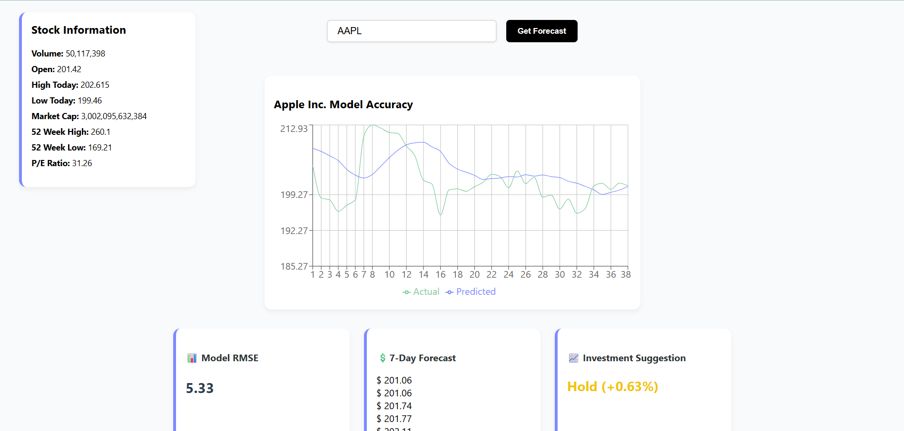

## Stock Prediction App
This React web app allows users to forecast stock prices and evaluate the accuracy of a predictive model (e.g., LSTM). It provides:
- Historical vs. Predicted Closing Price Graph
- RMSE (Root Mean Square Error) Evaluation
- 7 Day Forecast Visualization with Confidence Interval Bands
- Investment Suggestions (Buy / Sell / Hold)
- Sidebar with Live Stock Details

### Preview

### Frontend
- React.js
- HTML/CSS
- Recharts
- Vercel (Deployment)

### Backend
- Python
    - Scikit-Learn
    - Tensorflow (Keras)
    - NumPy
    - Pandas
    - Yfinance (Yahoo Finance)
- FastApi
- Docker
- Render (Deployment)

### Future Ideas
- Allow model selection for more diverse outputs (LSTM, Linear Regression, ARIMA)
- Export forecast as a CSV for further analysis
- Include Technical Indicators for increased accuracy and decreased RMSE

### Author
Made by Dylan Giletto
[Portfolio](https://portfolio-dgilettos-projects.vercel.app/) | [LinkedIn](https://www.linkedin.com/in/dylan-giletto-775789269/) | [Github](https://github.com/dgiletto)

Link to the Web App: https://stock-prediction-olive.vercel.app/